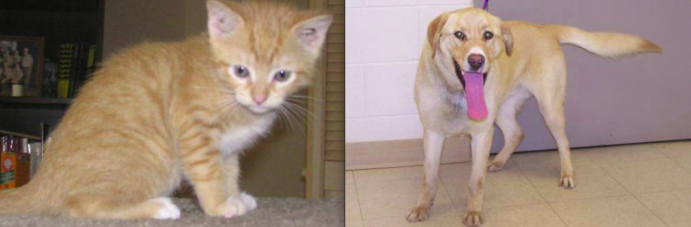
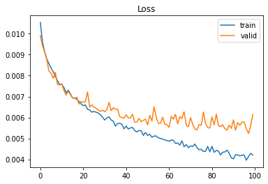
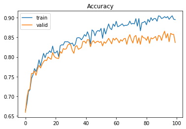

a simple Image-Classifier with PyTorch for classifing image wheather it contain Cat or Dog.
### Model structure
the intial goal here is to build simple network becuase we can achive much better results with Transfer Learning. so after couple of trails, last it went with 26226 total trainable parameters.

|image   (224x224x3)|
|:---:| 
| Conv2d + ReLU +  Maxpool2d |
| Conv2d + ReLU +  Maxpool2d |
| BatchNorm2d |
| Conv2d + ReLU +  Maxpool2d |
| Conv2d + ReLU +  Maxpool2d |
| BatchNorm2d |
| Linear + Dropout |

|Loss|Accuracy|
|:---:| :---:| 
|| |
* Test Accuracy: 0.86, sorry bit over-fitting :)
### Data set

I used [Dogs & Cats Images](https://www.kaggle.com/chetankv/dogs-cats-images) from kaggle website for training network.

### Execution

        >> python app.py data/cat.jpg
        Image: data/cat.jpg  --->  Cat 0.9896895885467529%

### Acknowledgments
* Pytorch [docs](https://pytorch.org/docs/stable/index.html)
* Dogs & Cats Images [data set](https://www.kaggle.com/chetankv/dogs-cats-images)